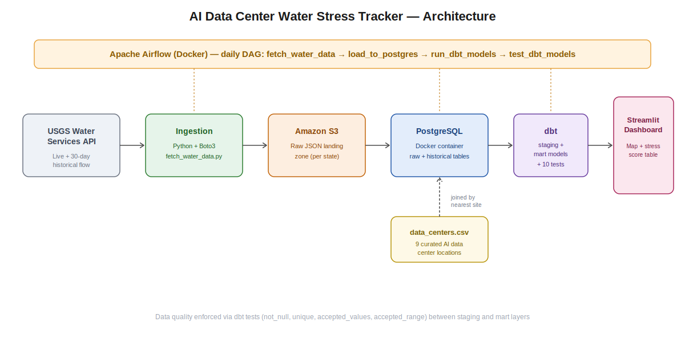
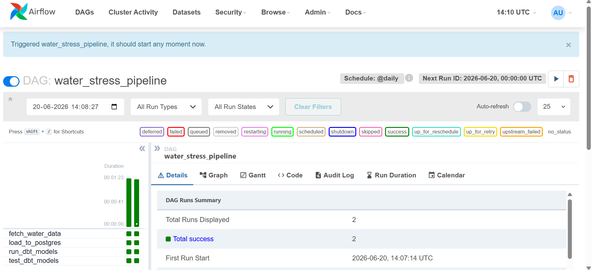
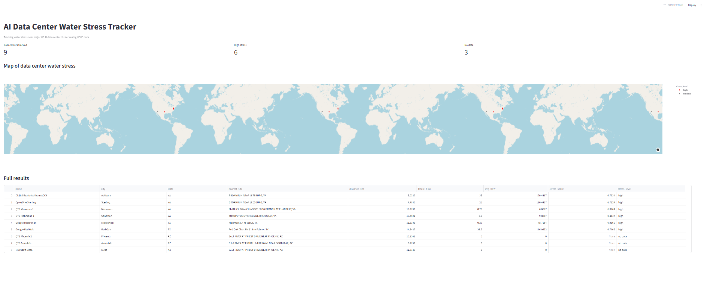

# AI Data Center Water Stress Tracker

A data engineering pipeline that ingests real-time and historical water flow data from the USGS Water Services API, joins it against known AI data center locations, computes a water-stress score per site, and surfaces it through a dashboard — all orchestrated by Apache Airflow and tested with dbt.



---

## Table of Contents

- [Overview](#overview)
- [Architecture](#architecture)
- [Tech Stack](#tech-stack)
- [Project Structure](#project-structure)
- [Data Flow](#data-flow)
  - [Ingestion](#ingestion)
  - [Storage](#storage)
  - [Transformation (dbt)](#transformation-dbt)
  - [Data Quality](#data-quality)
  - [Orchestration (Airflow)](#orchestration-airflow)
- [Dashboard](#dashboard)
- [Prerequisites](#prerequisites)
- [Setup](#setup)
- [Running the Pipeline](#running-the-pipeline)
- [Results](#results)
- [Data Sources](#data-sources)

---
## Overview

AI data centers consume enormous volumes of water for cooling. While carbon footprint tracking for AI infrastructure is becoming common, water stress is rarely monitored at the same resolution. This project is a working prototype of that monitoring pattern: it tracks real water flow near a curated set of major US AI data center sites and flags which ones sit near water sources currently running below their 30-day average.

This is a **data engineering portfolio project** — the goal is to demonstrate the full pipeline lifecycle (ingestion → storage → transformation → testing → orchestration), not to deliver a production-grade water risk product.

---
## Architecture

```
Data Source              Ingestion            Storage              Transform            Orchestration         Output
┌──────────────┐    ┌────────────────┐   ┌────────────────┐   ┌────────────────┐   ┌────────────────┐   ┌──────────────┐
│ USGS Water   │    │                │   │                │   │                │   │                │   │              │
│ Services API │───>│  Python +      │──>│  Amazon S3     │──>│  Postgres      │──>│  dbt models    │   │  Streamlit   │
│ (live +      │    │  boto3         │   │  (raw JSON)    │   │  (Docker)      │   │  + tests       │──>│  Dashboard   │
│ 30-day       │    │                │   │                │   │                │   │                │   │              │
│ historical)  │    └────────────────┘   └────────────────┘   └────────────────┘   └────────────────┘   └──────────────┘
└──────────────┘                                                       ▲                    │
                                                                       │                    │
                    ┌──────────────┐                                   │                    ▼
                    │ data_centers │───────────────────────────────────┘           ┌────────────────┐
                    │   .csv       │      (joined by nearest site)                 │ Apache Airflow │
                    └──────────────┘                                               │  (daily DAG)   │
                                                                                   └────────────────┘
```

**Orchestration** is handled by Apache Airflow running in Docker, which schedules and sequences all four pipeline stages daily: ingestion → load → transform → test.

---
## Tech Stack

| Component           | Technology                          |
|---------------------|--------------------------------------|
| **Ingestion**       | Python, Requests, Boto3              |
| **Cloud Storage**   | Amazon S3                            |
| **Database**        | PostgreSQL (Docker)                  |
| **Transformation**  | dbt (dbt-postgres)                   |
| **Data Quality**    | dbt tests, dbt_utils                 |
| **Orchestration**   | Apache Airflow (Docker, custom image)|
| **Dashboard**       | Streamlit, Plotly                    |
| **Infrastructure**  | Docker, Docker Compose                |
| **Cloud/Auth**      | AWS IAM, AWS CLI                     |
| **Languages**       | Python 3, SQL                        |

---

## Project Structure
```
ai-data-center-water-risk-pipeline/
│
├── lambdas/
│   └── fetch_water_data.py          # Pulls live USGS data, uploads raw JSON to S3
│
├── scripts/
│   ├── fetch_historical_water.py    # Pulls 30-day historical USGS data
│   ├── load_to_postgres.py          # Loads raw S3 JSON into Postgres
│   ├── load_historical_to_postgres.py
│   └── compute_water_stress.py      # Standalone Python version of the stress calc
│
├── dbt_project/
│   └── water_stress_dbt/
│       ├── models/
│       │   ├── staging/
│       │   │   ├── stg_water_readings.sql
│       │   │   └── schema.yml       # not_null, accepted_values tests
│       │   └── marts/
│       │       ├── mart_water_stress.sql
│       │       └── schema.yml       # unique, accepted_range tests
│       └── packages.yml             # dbt_utils dependency
│
├── airflow/
│   ├── Dockerfile                   # Custom image: boto3, psycopg2, dbt-postgres
│   ├── docker-compose.yml
│   └── dags/
│       └── water_pipeline_dag.py    # 4-task daily DAG
│
├── docker/
│   └── docker-compose.yml           # Postgres container
│
├── data/
│   └── data_centers.csv             # 9 curated AI data center locations (VA, AZ, TX)
│
├── dashboard.py                     # Streamlit dashboard
└── README.md
```

---
## Data Flow

### Ingestion

`fetch_water_data.py` pulls live readings from the USGS Water Services API (no API key required) for Virginia, Arizona, and Texas, and uploads raw JSON to S3:

```
s3://<bucket>/raw/{state}/{timestamp}.json
s3://<bucket>/historical/{state}/{timestamp}.json
```

`fetch_historical_water.py` separately pulls 30 days of daily flow values per state, needed to compute a meaningful average (a single snapshot has no variation to compare against).

### Storage

`load_to_postgres.py` / `load_historical_to_postgres.py` parse the raw S3 JSON and insert structured rows into two Postgres tables: `raw_water_readings` and `historical_water_readings`.

### Transformation (dbt)

Two dbt models replace the original Python transformation logic with version-controlled SQL:

- **`stg_water_readings`** — staging layer, filters nulls
- **`mart_water_stress`** — joins readings against `data_centers.csv` by nearest site (geodesic distance), computes:

```
stress_score = 1 - (latest_flow / avg_flow)
```
clamped between 0 and 1, with explicit `NULL` handling for sites with zero/missing flow rather than silently reporting a false "low stress."

### Data Quality

10 dbt tests run against both models, including `not_null`, `unique`, `accepted_values`, and a `dbt_utils.accepted_range` check on the stress score. These tests caught two real bugs during development:

1. **423 duplicate rows** in the mart model, caused by an unaggregated join on same-day readings — fixed with an additional `GROUP BY`.
2. **Out-of-range stress scores** exceeding 1.0 — fixed by wrapping the calculation in `LEAST(..., 1)`.

### Orchestration (Airflow)

A daily DAG runs all four stages in sequence:

```
fetch_water_data >> load_to_postgres >> run_dbt_models >> test_dbt_models
```

Airflow runs in a custom Docker image (the official image doesn't ship with `boto3`/`psycopg2`/`dbt-postgres`), on a Docker network shared with the Postgres container so the two can resolve each other by container name instead of `localhost`.

---
## Dashboard

A lightweight Streamlit dashboard reads directly from the `mart_water_stress` table and shows:

- Summary metrics (data centers tracked, high-stress count, no-data count)
- A map of all tracked data centers, colored by stress level
- A full results table with the nearest water site, distance, flow values, and stress score per data center

This is intentionally a verification view, not a BI deliverable — building polished, stakeholder-facing dashboards (Power BI, Tableau) is typically analyst-owned work; this dashboard exists to prove the pipeline output is correct and usable.

---
## Prerequisites

- Docker Desktop (with WSL2 on Windows)
- Python 3.10+
- An AWS account with an IAM user (S3 access) and AWS CLI configured
- `dbt-postgres`

---

## Setup
```bash
git clone https://github.com/<your-username>/ai-data-center-water-risk-pipeline.git
cd ai-data-center-water-risk-pipeline

python -m venv venv
venv\Scripts\activate        # Windows
pip install -r requirements.txt

aws configure                # enter your IAM access key/secret
aws s3 mb s3://<your-bucket-name>
```

Update the `BUCKET` variable in `lambdas/fetch_water_data.py` and `scripts/load_to_postgres.py` to match your bucket name.

Start Postgres:
```bash
cd docker
docker compose up -d
```

Initialize dbt:
```bash
cd dbt_project
dbt init water_stress_dbt
dbt deps
```

---

## Running the Pipeline

### Manual (for local testing)
```bash
python lambdas/fetch_water_data.py
python scripts/fetch_historical_water.py
python scripts/load_to_postgres.py
python scripts/load_historical_to_postgres.py
cd dbt_project/water_stress_dbt && dbt run && dbt test
streamlit run dashboard.py
```

### Automated (Airflow)
```bash
cd airflow
docker compose build
docker compose up -d
```
Visit `http://localhost:8080`, log in with the auto-generated admin password (printed to `/opt/airflow/standalone_admin_password.txt` inside the container), unpause `water_stress_pipeline`, and trigger it.

---
## Results

All four pipeline stages run successfully end-to-end, scheduled daily:



Sample output from `mart_water_stress`:


---
## Data Sources

- [USGS Water Services API](https://waterservices.usgs.gov/) — public, free, no API key required
